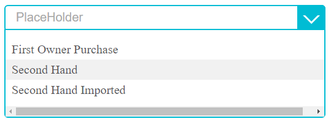
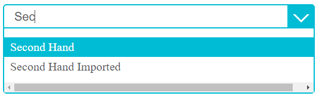

# React Custom TypeahHead Dropdown

This is a custom type a head dropdown.
It is developed using:
- React
- npm
- gulp
- broswerify 

It looks like as follows in different scenarios:

**Initial State**


**Open State**




**Selection State**


**Selection & Open State**


**Filter State **




# Usage
Currently, It will support to use with broswerify.

```
var render = require("PATH/type-a-head.jsx");
render(domElement, configarationObject);
```


**Input**
- Dom Elemet: It is the place where we need to render the component

- Configuration Object

```
{
	'title': "Title",
	'placeHolder': "PlaceHolder",
	'items': list, //List of dropdown items
	'idToRender': 'id', //Id to render in list for item
	'nameToRender': 'description', //Name to render in list for item
	'selectedItem': { //Default selected element
		"id" : "2", //idToRender
		"description" : "Second Element" //nameToRender
	},
	'selectCallback':selectCallback, //Callback for getting selected element
	'allowedChars': null, // RegEx for restricting characters to enter, Ex: /\d/ (to allow onnly numbers)
	'isDisabled': false // To disabled to the filed
}
```

**Output**
It will return selected element to a callback function. The object looks as follows:

```
{
	"id" : "5", //idToRender
	"description" : "Fifth Element" //nameToRender
}
```

# Todos
- Need to make css as easy customizable